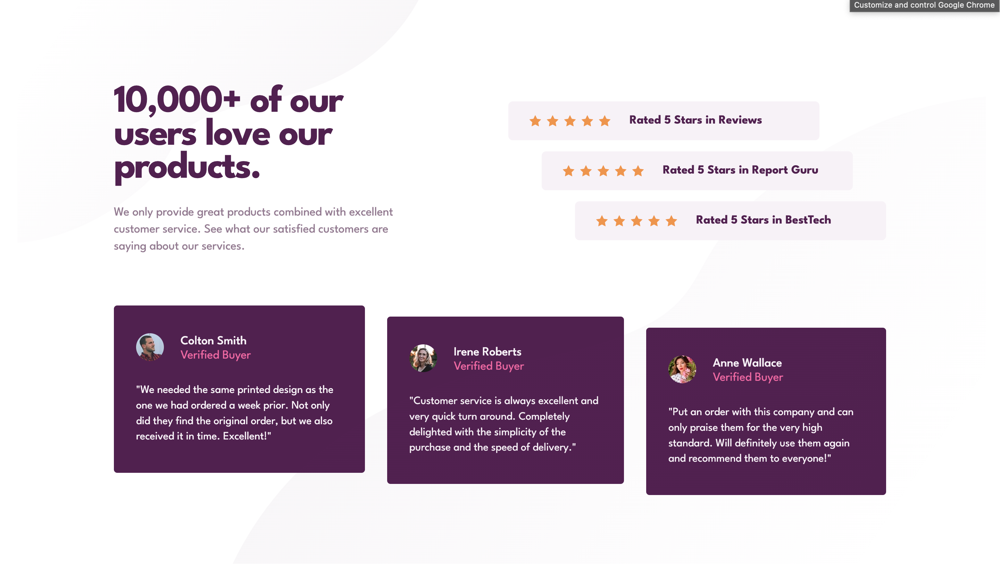

# Frontend Mentor - Social proof section solution

This is a solution to the [Social proof section challenge on Frontend Mentor](https://www.frontendmentor.io/challenges/social-proof-section-6e0qTv_bA).

## Table of contents

- [Overview](#overview)
  - [The challenge](#the-challenge)
  - [Screenshot](#screenshot)
  - [Links](#links)
- [My process](#my-process)
  - [Built with](#built-with)
  - [What I learned](#what-i-learned)
  - [Continued development](#continued-development)
- [Author](#author)

## Overview

### The challenge

Users should be able to:

- View the optimal layout for the section depending on their device's screen size

### Screenshot



### Links

- Solution URL: [https://github.com/kongguksu/social-proof-section.git]
- Live Site URL: [https://kongguksu.github.io/social-proof-section/]

## My process

### Built with

- Semantic HTML5 markup
- CSS custom properties
- Flexbox
- Deskptop-first workflow

### What I learned

I learned how to position cards to look like staircase by using negative values for margin.

```css
/* Rating rec positioning */
.rating-left {
  margin-left: -6rem;
  margin-right: 6rem;
}

.rating-middle {
  margin-left: -3rem;
  margin-right: 3rem;
}

/* Testimonial cards positioning */
.box-middle {
  margin-top: 1rem;
  margin-bottom: -1rem;
}

.box-right {
  margin-top: 2rem;
  margin-bottom: -2rem;
}
```

### Continued development

Using multiple images to form background pattern.

## Author

- Frontend Mentor - [@kongguksu](https://www.frontendmentor.io/profile/kongguksu)
- Twitter - [@sooj2050](https://www.twitter.com/sooj2050)
